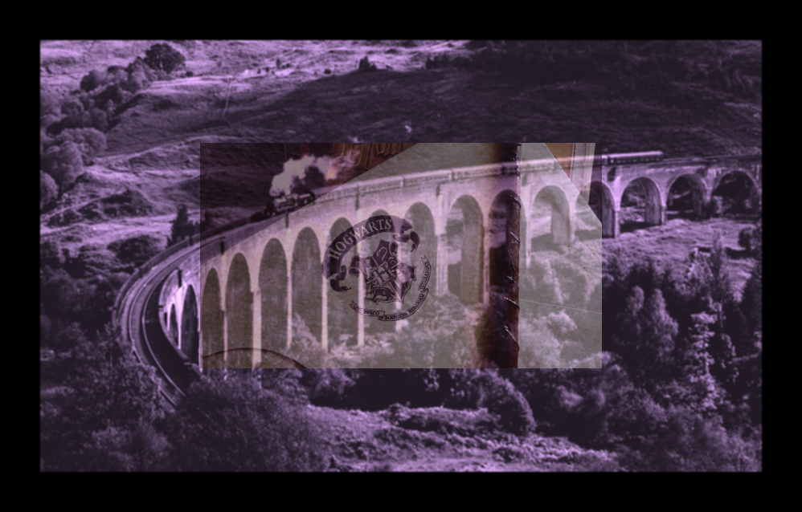

# pixmap-ops

Image manipulation demos based on the PPM image format.

TODO: Add a representative image for your project here

## How to build

*Windows*

Open git bash to the directory containing this repository.

```
pixmap-ops $ mkdir build
pixmap-ops $ cd build
pixmap-ops/build $ cmake -G "Visual Studio 16 2019" ..
pixmap-ops/build $ start Pixmap-Ops.sln
```

Your solution file should contain two projects: `pixmap_art` and `pixmap_test`.
To run from the git bash command shell, 

```
pixmap-ops/build $ ../bin/Debug/pixmap_test
pixmap-ops/build $ ../bin/Debug/pixmap_art
```

*macOS*

Open terminal to the directory containing this repository.

```
pixmap-ops $ mkdir build
pixmap-ops $ cd build
pixmap-ops/build $ cmake ..
pixmap-ops/build $ make
```

To run each program from build, you would type

```
pixmap-ops/build $ ../bin/pixmap_test
pixmap-ops/build $ ../bin/pixmap_art
```

## Image operators

**Original Image:**


**Rotate Clockwise:**
Rotate an image 90 degree clockwise.
```
ppm_image rotateClockwise()
```


**Invert Colors:**
Invert the colors of an image, white becomes black, orange becomes blue, and so on. 
```
ppm_image invertColors()
```


**Sepia:**
Give an image an old-timey feel by making it look reddish-brown.
```
ppm_image sepia()
```


**Border:**
Add a black border around the edge of an image.
```
ppm_image rotateClockwise()
```


**Swirl Colors:**
Rotate the colors of an image.
```
ppm_image swirlColors()
```


**Box Blur:**
Create the effect of blurring or softening an image.
```
ppm_image boxBlur()
```


## Results

Apply the sepia, border, box blur, and swirl colors filters on an image:



